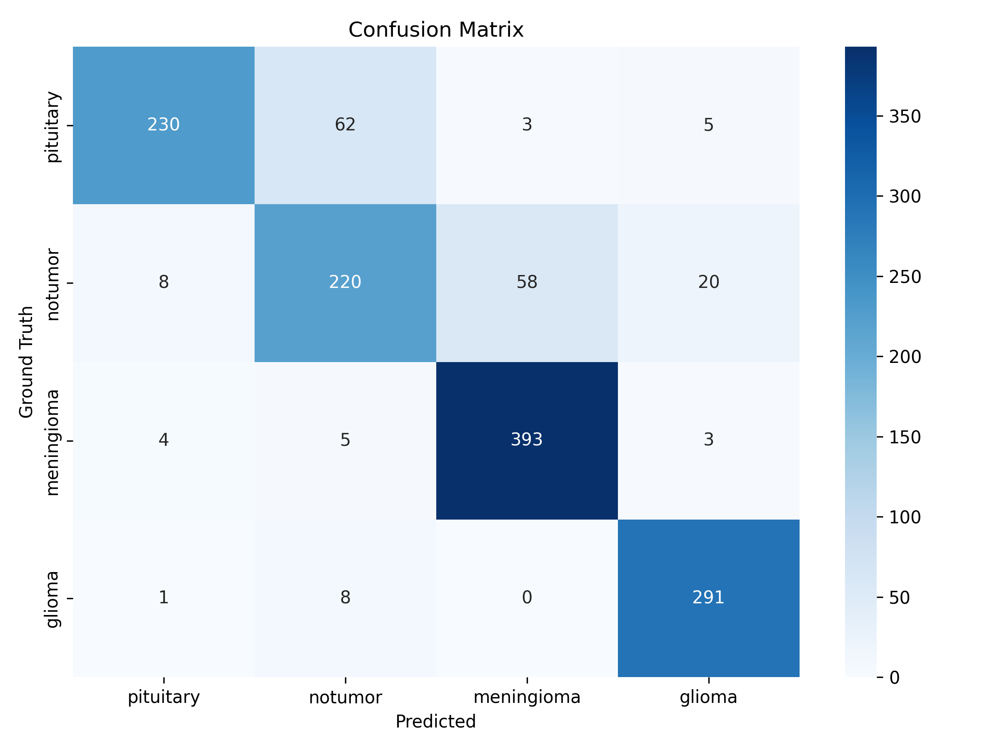
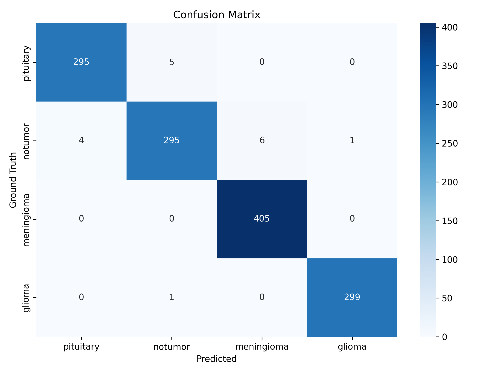
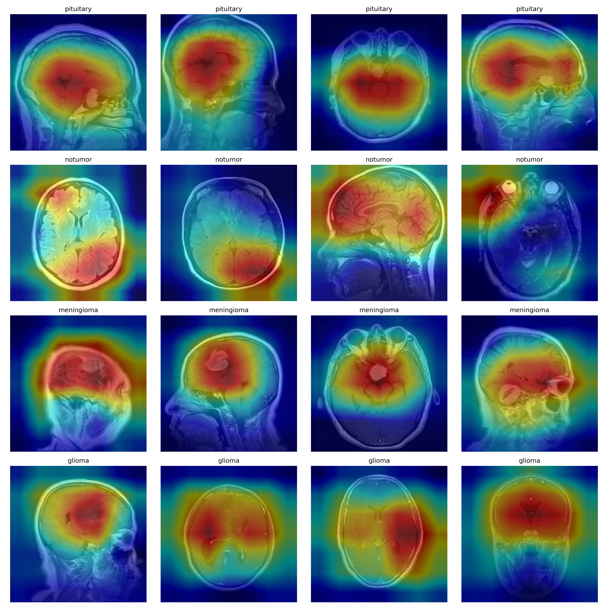

# TumorNet

**TumorNet** is a deep learning pipeline for brain tumor classification using MRI scans. It leverages a pre-trained ResNet18 model for multi-class classification and provides interpretability through Grad-CAM visualizations. Additionally, we explore pseudo-segmentation of tumor regions for potential localization tasks using U-Net.

---

## Dataset

The dataset consists of brain MRI images categorized into four tumor types:

```
Dataset/
    ├── training/
    │    ├── glioma/
    │    ├── meningioma/
    │    ├── pituitary/
    │    └── no_tumor/
    └── testing/
         ├── glioma/
         ├── meningioma/
         ├── pituitary/
         └── no_tumor/
```

---

## Dataset Visualization

To understand the dataset distribution and sample images from each class, a visualization was generated as shown below:


> The images show the intra-class variation, and some tumor types (e.g., glioma and meningioma) have subtle differences, making classification challenging.

---

## Data Preprocessing & Augmentation

Before feeding MRI images into the neural network, essential **preprocessing** and **data augmentation** steps are applied to ensure consistency and improve model generalization.
The following transformations are used for the **training** and **validation** datasets:

```python
data_transforms = {
    'train': transforms.Compose([
        transforms.Resize((224, 224)),
        transforms.RandomHorizontalFlip(),
        transforms.ToTensor(),
        transforms.Normalize(mean=[0.485, 0.456, 0.406], 
                             std=[0.229, 0.224, 0.225])
    ]), 
    'val': transforms.Compose([
        transforms.Resize((224, 224)),
        transforms.ToTensor(),
        transforms.Normalize(mean=[0.485, 0.456, 0.406], 
                             std=[0.229, 0.224, 0.225])
    ])
}
```

### Breakdown of Transformations:

| Transformation           | Description                                                                                                                           |
| ------------------------ | ------------------------------------------------------------------------------------------------------------------------------------- |
| **Resize (224x224)**     | Resizes all images to a fixed size of 224x224 pixels, ensuring uniform input dimensions suitable for ResNet18.                        |
| **RandomHorizontalFlip** | Randomly flips images horizontally during training to augment data variability and reduce overfitting.                                |
| **ToTensor()**           | Converts PIL images (or numpy arrays) into PyTorch tensors with pixel values scaled to \[0,1].                                        |
| **Normalize(mean, std)** | Normalizes each channel (R, G, B) using ImageNet’s mean and standard deviation to align with the pre-trained ResNet18’s expectations. |


## Baseline Model — ResNet18 (Feature Extractor)

For initial classification, a pre-trained **ResNet18** was used with its final fully connected layer modified to output **4 classes**.

```python
model.fc = nn.Linear(model.fc.in_features, 4)
```

The model was trained with frozen feature extractor layers. Below is the Confusion Matrix:

### Confusion Matrix — Baseline



---

## Fine-Tuning — Unfreezing Layer4

To improve performance, **Layer4** of ResNet18 was unfrozen and fine-tuned on the dataset. This allowed the deeper layers to adjust to domain-specific features of brain tumors.

```python
for param in model.layer4.parameters():
    param.requires_grad = True
```

### Confusion Matrix — Fine-Tuned ResNet18



---

## Model Performance — Baseline vs Fine-Tuned

The **TumorNet** classification pipeline was evaluated in two stages:

| Metric        | Baseline | Fine-Tuned |
| ------------- | -------- | ---------- |
| **Accuracy**  | 86.50%   | 98.70%     |
| **Precision** | 86.68%   | 98.70%     |
| **Recall**    | 86.50%   | 98.70%     |
| **F1-Score**  | 86.26%   | 98.70%     |

**Baseline (Frozen ResNet18):**

* Decent performance but struggles with **No Tumor** and **Pituitary** cases.
* Glioma and Meningioma detection was strong, but overall lacked fine-grained feature learning.

**Fine-Tuned (Unfreezing Layer4):**

* Significant boost across all metrics.
* Near-perfect classification in all tumor types after fine-tuning deeper layers.
* Fine-tuning enabled the model to better learn domain-specific features.

> Fine-tuning Layer4 of ResNet18 drastically improved classification accuracy and balance across all tumor classes.

---


## Model Interpretability with Grad-CAM

While the classification accuracy improved, understanding **why** the model predicts a particular class is crucial, especially in medical imaging tasks. For this, **Grad-CAM** (Gradient-weighted Class Activation Mapping) was used.

**Grad-CAM** highlights the spatial regions in the input image that contribute most to the model's decision, providing visual explanations.

### Grad-CAM Visualization Example



> The highlighted heatmap overlays indicate the tumor regions the model focuses on, providing trustable visual feedback for the predictions.

---

## Future Work — Pseudo-Segmentation using U-Net

While TumorNet successfully classifies brain tumors and visualizes important regions via Grad-CAM, the next step is to transition towards **tumor localization** and **segmentation**. This involves generating **binary masks** that accurately outline tumor regions within MRI scans.

### Approach:

* Encoder: Layers from the fine-tuned ResNet18 are reused.
* Decoder: Custom-built upsampling layers for segmentation.
* Input: **224x224x3** was converted to **128x128x3** for quicker results (requires fine-tuning) on MRI images.
* Output: **128x128x1** binary segmentation mask.

> This is a work-in-progress aimed at refining tumor localization using weakly-supervised methods, leveraging Grad-CAM activations as soft labels.

### 1. **Pseudo-Semantic Segmentation using Grad-CAM**

* The Grad-CAM heatmaps produced during classification highlight discriminative regions but are not precise enough for pixel-level segmentation.
* As a next step, these Grad-CAM heatmaps will be thresholded to create **pseudo-labels** (binary masks), which can be used as weak supervision signals.
* This approach will act as a form of **weakly-supervised learning**, enabling segmentation without manually annotated masks.

### 2. **U-Net Architecture for Tumor Mask Generation**

* A **U-Net** architecture will be designed, where:
* 
  * **Encoder**: Pre-trained layers from the fine-tuned **ResNet18** will be used to retain strong feature extraction capabilities.
  * **Decoder**: Custom upsampling layers will be built to reconstruct spatial dimensions and predict segmentation masks.
    
* Input images will be of size **128x128x3**, and the output mask will be **128x128x1**, representing tumor vs. non-tumor regions.
* This pipeline aims to refine tumor localization based on the initial Grad-CAM derived masks, improving segmentation quality iteratively.


### 4. **Segmentation Model Evaluation**

* Evaluation of the U-Net based segmentation performance using metrics such as:

  * **Dice Coefficient (F1 Score)**
  * **Intersection over Union (IoU)**
  * **Binary Cross Entropy (Pixel Wise Accuracy)**


---

## Reference

The dataset used in this project is sourced from Kaggle:

**Brain Tumor MRI Dataset**
[https://www.kaggle.com/datasets/masoudnickparvar/brain-tumor-mri-dataset](https://www.kaggle.com/datasets/masoudnickparvar/brain-tumor-mri-dataset)


